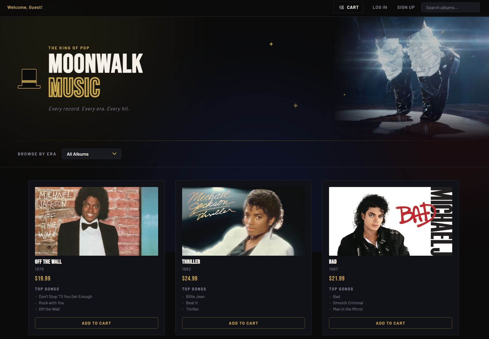

# MoonWalk Music



MoonWalk Music is a lightweight, full-stack tribute to the artistry of Michael Jackson. It delivers a simple album gallery and store experience with a Node.js backend and a clean, minimal frontend.

## Featured Albums

- Off the Wall (1979)
- Thriller (1982)
- Bad (1987)
- Dangerous (1991)
- HIStory: Past, Present and Future, Book I (1995)
- Invincible (2001)

## Features

- Browse albums with era, year, genre, and top songs
- Simple cart flow and product browsing UI
- Session-based authentication for signup and login
- SQLite-backed data store with seed scripts

## Tech Stack

- Backend: Node.js, Express, SQLite
- Frontend: HTML, CSS, JavaScript
- Auth: bcryptjs, express-session

## Project Structure

- controllers/ - request handlers
- routes/ - API route definitions
- db/ - database connection helper
- sql/ - schema and seed scripts
- data/ - static album dataset
- public/ - frontend pages, scripts, and styles

## Getting Started

1. Install dependencies:
	```bash
	npm install
	```
2. Create a .env file with a session secret:
	```bash
	SPIRAL_SESSION_SECRET=your-session-secret
	```
3. Create tables and seed the database:
	```bash
	node sql/createTable.js
	node sql/seedTable.js
	```
4. Start the server:
	```bash
	npm start
	```
5. Open the app:
	```
	http://localhost:8000
	```

## API Routes

- GET /api/products
- GET /api/products/eras
- POST /api/auth/register
- POST /api/auth/login
- GET /api/auth/logout
- GET /api/auth/me

## Scripts

- npm start - start the server on port 8000